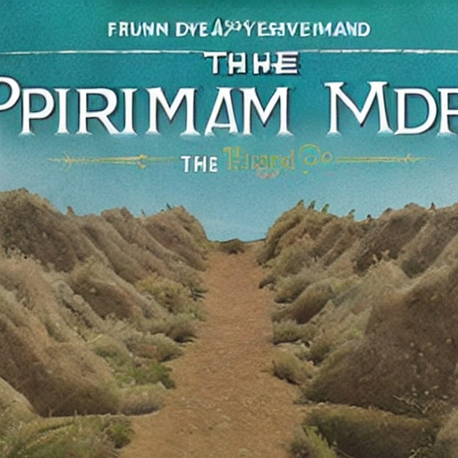

# promiseland
This project shows a dahsboard to compare treasury bills purchasing
##


# Framework
It is made with the dash framework

# install
```
    pip install -r requirements.txt
```

# Run
```
    python server.py
```

